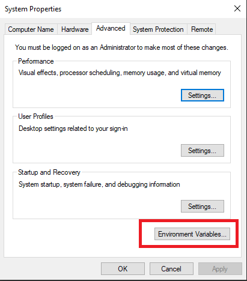
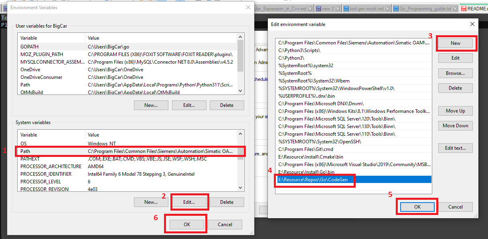

## C++ Code Generation GUI Tools
This tool was updated base on CppCodeGenerator, [visit below link for more detail](https://github.com/e-loughlin/CppCodeGenerator)

 
 ## Installation
```
git clone https://github.com/TheSonNguyen/Function-Detect.git

```
 
To able to use in the everywhere :
Please add PATH include ./build/codegen.bat to system environments

step 1



step 2


### Files that can be generated:
- Interfaces
- Class Headers (.h / .hpp) and Implementations (.cpp / .cxx)
- Mock Classes (GoogleMock)
- Test Classes (GoogleTest)

### Status 
basically completed
## Usage

https://youtu.be/Q-pYxtAG60U
